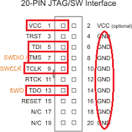

# FPGA PROGRAM & DEBUG GUIDE

* * *

# I. Program the board

## I. a) VC707

Remember to switch the switches above the LCD to UP-UP-DOWN-UP-DOWN,
then open vivado, open hardware manager, open target board, auto connect.

Vivado direct programming:

	a. right-click on the xc7vx485t_0
	b. Program Device ...
	c. select the .bit file
	d. Program

Vivado flash programming:

	a. right-click on the xc7vx485t_0
	b. Add Configuration Memory Device ...
	c. select the one with the Alias of 28f00ag18f ---> OK
	d. OK to continue to program the device
	e. select the Configuration file (.mcs) and PRM file (.prm)
	f. select the RS pins: 25:24
	g. OK to write data to the flash
	h. finally, right-click again on the xc7vx485t_0 and select Boot from Configuration Memory Device

# I. b) DE4 & TR4

Power on the board, plugin the cable, then open Quartus and click on the 'Programmer' icon *(or in the top menu -> Tool -> Programmer)*. A Programmer window will appear:

	a. Check the 'Hardware Setup..' on the top left to see it recognizes the usb port or not. If it shows 'No hardware..' then your computer not yet recognizes the cable. If it shows 'USB-Blaster [USB-x]' then okay to continue
	b. Click 'Auto Detect' then:
		if DE4: choose the first one: 'EP4SGX230' then 'OK'
		if TR4: choose
	c. Double-click on the <none> in the tab 'File' and browse to the .sof file
	d. Tick on the 'Program/Configure' then hit 'Start' to program the board, and wait for it to finish

# II. Debug with GDB via JTAG

Using the Olimex JTAG debugger. Ref [link](https://www.olimex.com/Products/ARM/JTAG/ARM-USB-TINY-H/).

## II. a) Driver

To install the driver for the debugger:

	$ sudo apt-get install libftdi-dev libftdi1
	$ sudo vi /etc/udev/rules.d/olimex-arm-usb-tiny-h.rules

Then add this single line in the olimex-arm-usb-tiny-h.rules file:

	SUBSYSTEM=="usb", ACTION=="add", ATTRS{idProduct}=="002a", ATTRS{idVendor}=="15ba", MODE="664", GROUP="plugdev"

## II. b) Connection

### (i) VC707

Connect your Olimex JTAG debugger to the VC707 FPGA board by the XADC (J19) header as shown as follows:

The four data pins TDI (pin 5), TMS (pin 7), TCLK (pin 9), and TDO (pin 13) are connected to the XADC_GPIO 0 to 3 (pin 17 to 20). The VCC (pin 1) is connected to the XADC_VCC_HEADER (pin 14). And any of the GND pin on the JTAG side is connected to the GND pin 16 of the XADC header.

### (ii) DE4

Connect your Olimex JTAG debugger to the DE4 FPGA board by the GPIO_1 (JP4) header, with JTAG pin 1 connects to GPIO pin 1, etc.

The UART uses the RS232 connection on the board.

### (iii) TR4

Connect your Olimex JTAG debugger to the TR4 FPGA board by the GPIO_1 (JP10) header, with JTAG pin 1 connects to GPIO pin 1, etc.

For UART:
- GPIO_1 (JP10) HSMC_TX_n[3] (pin 39 of 40-pin header) : TX ---> connects to the outside RX
- GPIO_1 (JP10) HSMC_TX_n[1] (pin 40 of 40-pin header) : RX <--- connects to the outside TX
- GPIO_1 (JP10) pin 30 of 40-pin header : GND <---> connects to the UART GND

## II. c) Run

You need to prepare your riscv-openocd folder, guide is in [Initial Setup: II.g)](./init.md#ii-g-openocd).

Copy this [file](./openocd.cfg) to your **riscv-openocd/** folder. Then:

	$ cd to your riscv-openocd/ folder
	$ openocd -f openocd.cfg

If succeed, it will print something like this:

	$ openocd -f openocd.cfg 
	Open On-Chip Debugger 0.10.0+dev-00824-gf93ede540 (2019-11-05-10:20)
	Licensed under GNU GPL v2
	For bug reports, read
		http://openocd.org/doc/doxygen/bugs.html
	Info : auto-selecting first available session transport "jtag". To override use 'transport select <transport>'.
	Info : ftdi: if you experience problems at higher adapter clocks, try the command "ftdi_tdo_sample_edge falling"
	Info : clock speed 10000 kHz
	Info : JTAG tap: riscv.cpu tap/device found: 0x20000913 (mfg: 0x489 (SiFive Inc), part: 0x0000, ver: 0x2)
	Info : datacount=2 progbufsize=16
	Info : Disabling abstract command reads from CSRs.
	Info : Examined RISC-V core; found 4 harts
	Info :  hart 0: XLEN=64, misa=0x800000000014112d
	Info :  hart 1: XLEN=64, misa=0x800000000014112d
	Info :  hart 2: XLEN=64, misa=0x800000000014112d
	Info :  hart 3: XLEN=64, misa=0x800000000014112d
	Info : Listening on port 3333 for gdb connections
	Info : Listening on port 6666 for tcl connections
	Info : Listening on port 4444 for telnet connections

Then, open another terminal to start a GDB session: (remember to export the riscv toolchain to your PATH)

	$ riscv64-unknown-elf-gdb
	The GDB terminal will appear after this.
	
	From the GDB terminal, type:
	$ target extended-remote localhost:3333
	If succeed, the CPU will enter the debugging state after this command,
	and on the GDB terminal you can see the current instruction address

Some useful tips for debugging the RISC-V CPU:

	Run next line:			$ si
	Run continue:			$ c
	Set breakpoint:		$ hb 0x...
	Delete breakpoint:		$ delete
	Print cores info:		$ info threads
	Select core:			$ thread i			# i is the core number
	Set program counter:	$ set $pc=0x...
	Print registers table:	$ info registers
	Write to address:		$ set *0x...=0x...
	Read from address:		$ print/x *0x...
	Reset CPU:			$ monitor reset halt

* * *
